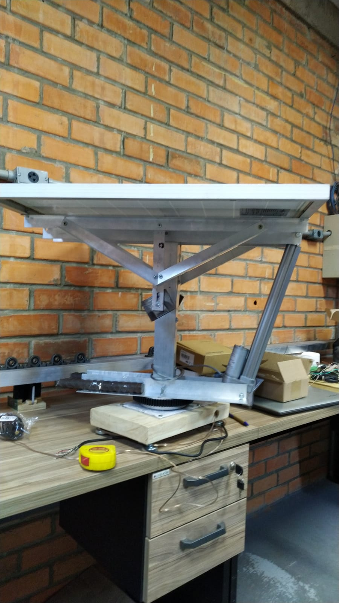
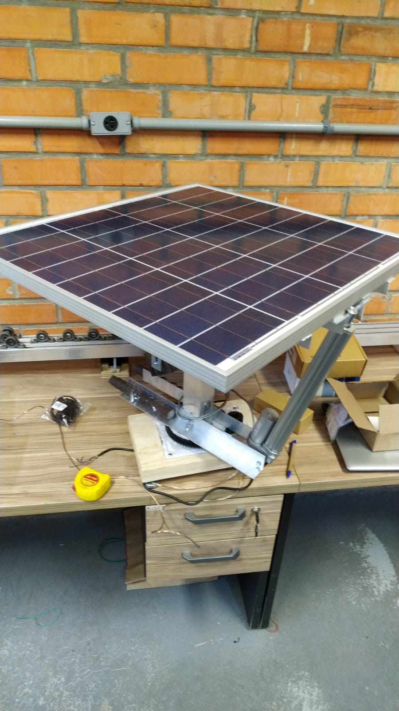
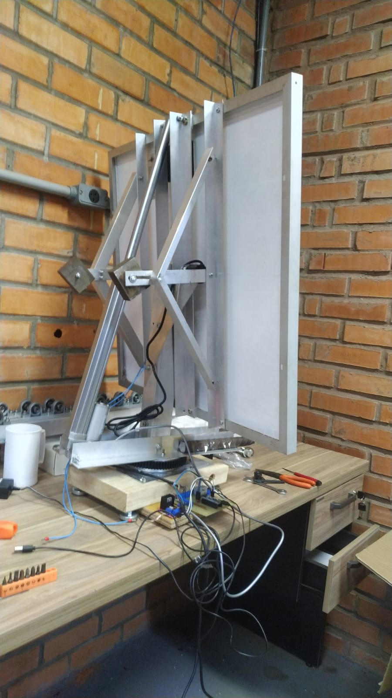
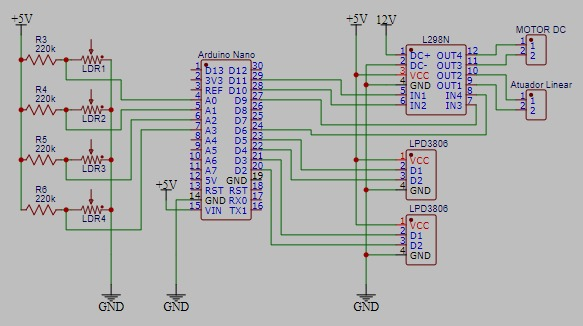
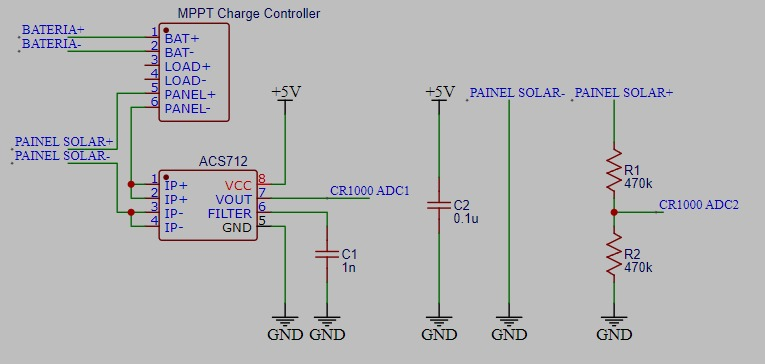
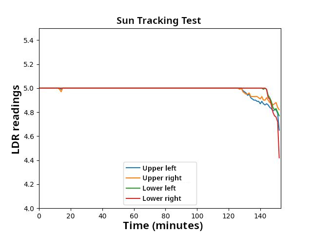

# Dual-Axis Solar Tracker (Rastreador Solar de Dois Eixos)

**Scientific Initiation Project – University of Brasília (UnB)**  
**Completed: September, 2022**

A self-built dual-axis solar panel tracker (azimuth + elevation) using an Arduino Mega, four-quadrant LDR sensors, quadrature encoders, DC motors / linear actuators, and a DS1307 RTC module.  

The system uses a **hybrid approach**:
- Sensor-based (LDR) for initial sun acquisition and fine adjustments
- Time-based closed-loop tracking using a pre-computed daily sun path table (azimuth & elevation angles)

No GPS or real-time astronomical calculations are performed on the microcontroller.

## Key Features

- Hybrid tracking: LDR closed-loop search/fine alignment + pre-calculated time-based trajectory following
- Position feedback via quadrature incremental encoders on both axes
- Smooth motion with PWM ramp-up/down tables for reduced mechanical stress
- Manual control using rotary encoder + push button and serial commands
- LDR value logging (analog & binary states) with hysteresis noise rejection
- Periodic LDR data storage to EEPROM for debugging/calibration
- Stall protection via movement timeouts
- Partial preparation for current/voltage monitoring (ACS712 + voltage dividers)

## Project Photos

### Early workshop assembly – side view

### Final mounted solar panel – top view

### Elevation mechanism close-up

### Main circuit board schematic

### Circuit to measure how much power was generated by the solar panel

### Results indicate no shadows cast on LDR, meaning excelent alingment! (5 V max ADC reading)

## Repository Structure

- `rast/`  
  Main Arduino sketch and headers:
  - `rast.ino` – core firmware
  - `pins.h` – pin definitions
  - `motion.h` – PWM ramped motor control
  - `ldrutils.h` – LDR reading, hysteresis, sun-search routine
  - `interface.h` – serial command parser & manual control
  - `tracking.h` – sun path table initialization & indexing

- `scripts_py/`  
  Python scripts used to:
  - Calculate solar position (azimuth & elevation) over the day
  - Generate the hardcoded arrays `trackAzims[]` and `trackElevs[]`

- `data/`  
  Trajectory data files:
  - CSV files containing hourly sun positions (used as input for the Python scripts)
  - Generated by a Matlab script to fit the particular season and location of the time and place of testing

- `DS1307setTime/`  
  Helper sketch to initially set the time on the DS1307 RTC module

## How It Works (Overview)

1. **Startup**  
   Reads current time from RTC → finds starting index in the pre-computed sun path tables.

2. **Modes** (toggled via long-press on rotary encoder button):
   - **Manual mode**: Jog axes (elevation up/down, azimuth cw/ccw) using the rotary encoder
   - **Tracking mode**:
     - Optional LDR-based initial acquisition (`pointToSun()`)
     - Main operation: compares current time against table → issues small movements when thresholds are crossed
     - Saves LDR readings to EEPROM every minute

3. **Useful serial commands** (115200 baud):
   - `h1`–`h4` / `l1`–`l4` → force motor driver pins HIGH/LOW
   - `u` `d` `cw` `ccw` → manual jog commands
   - `p` → run the LDR-based sun pointing routine
   - `v` → toggle verbose LDR output (binary states or analog values)

## Hardware

- **Microcontroller**: Arduino Mega 2560
- **Motor driver**: L298N-style dual H-bridge (PWM pins 3,5,9,10)
- **Light sensors**: 4× LDRs in voltage divider configuration
- **Position feedback**: 2× quadrature encoders
- **Timekeeping**: DS1307 RTC module
- **User interface**: Rotary encoder with push button
- **Mechanics**: Aluminum profile frame, linear actuator for elevation and geared DC motor for azimuth, 150 W solar panel

## Sun Path Tables

The arrays `trackAzims[]` and `trackElevs[]` (hardcoded in `tracking.h`) were generated offline using the Python scripts in `scripts_py/`.  
They provide approximate hourly positions for my specific location.

## Future Ideas

- Replace fixed table with real-time solar position calculation (e.g. using a library on a more powerful board)
- Add basic MPPT using voltage/current readings
- Implement wind stow / night parking safety
- Upgrade to ESP32 for Wi-Fi data logging
- Automatic LDR calibration routine

## License

MIT License

Personal Control & Automation Engineering project – University of Brasília, 2022.  
Feel free to open an issue with questions or suggestions!